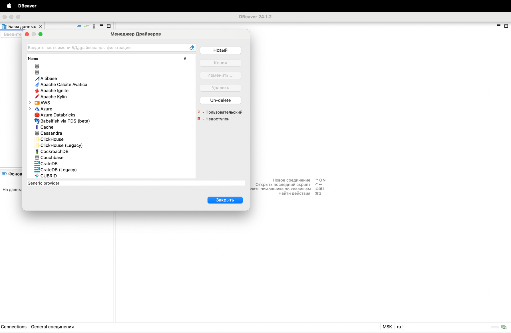
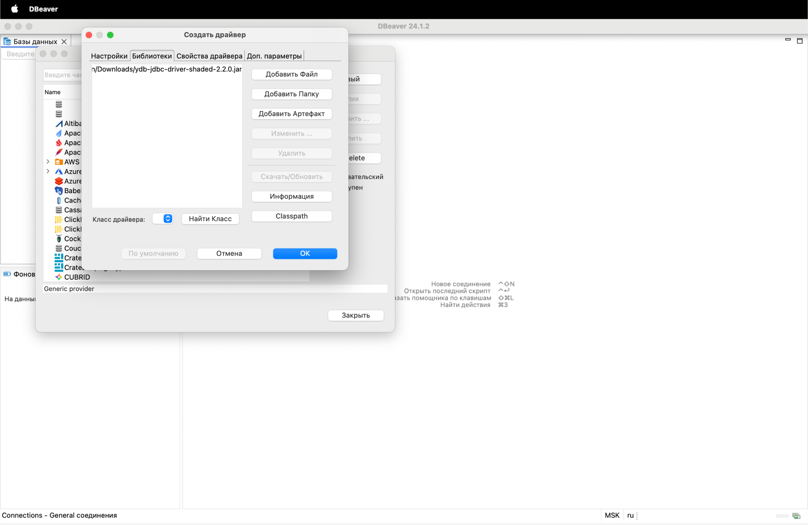
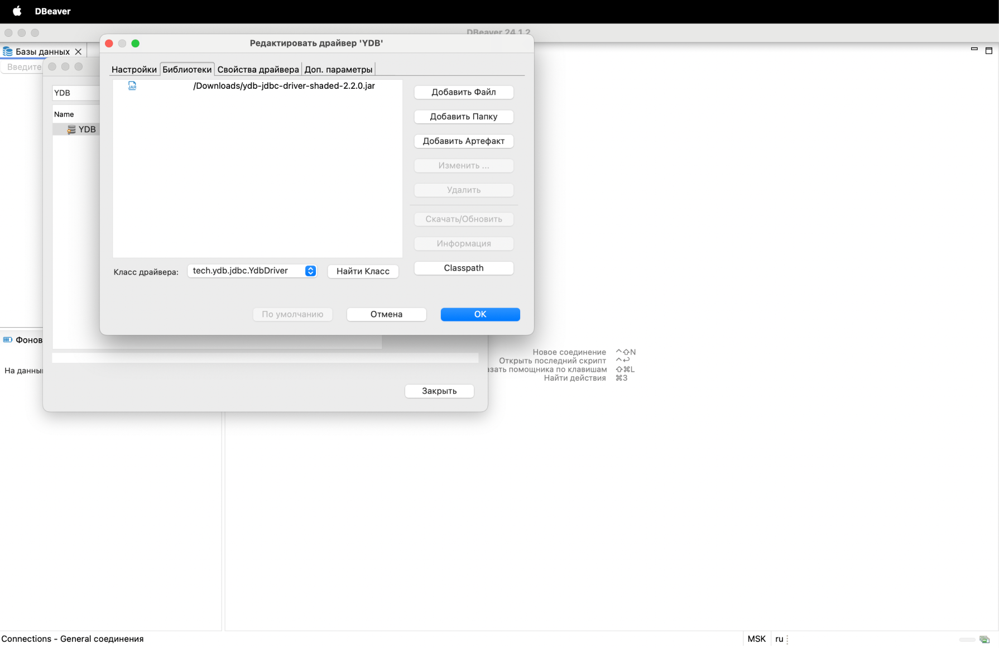
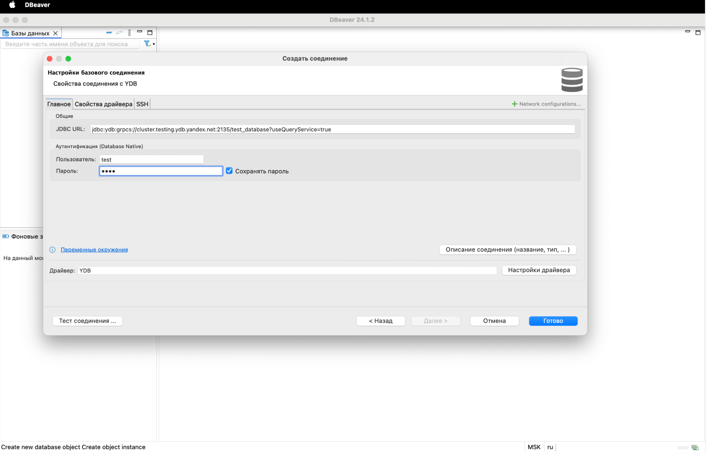
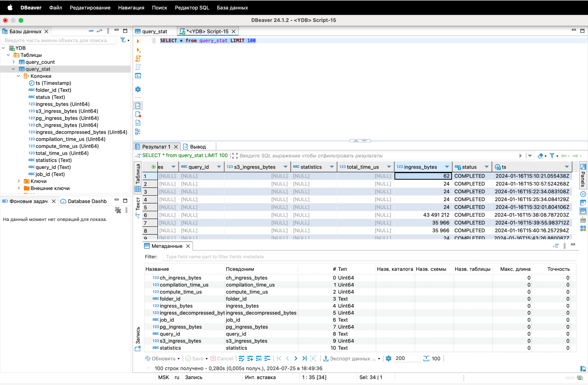

# Подключение с помощью IDE

{{ ydb-name }} позволяет выполнять подключения по протоколу Java DataBase Connectivity ([JDBC](https://ru.wikipedia.org/wiki/Java_Database_Connectivity)), поэтому для работы с подключениями в {{ ydb-name }} подходят графические IDE, также поддерживающие этот протокол: например DBeaver, DataGrip или другие.

В этом документе описан процесс подключения с помощью DBeaver, но подключение в рамках любой системы, поддерживающей источники данных JDBC, выполняется аналогично.

## DBeaver {#dbeaver}

[DBeaver](https://dbeaver.com) — бесплатный кроссплатформенный инструмент управления базами данных с открытым исходным кодом, обеспечивающий удобный интерфейс для подключения к различным базам данных и выполнения SQL-запросов. Он поддерживает множество баз данных, включая MySQL, PostgreSQL, Oracle, SQLite и другие.

### JDBC-драйвер {#jdbc}

Для подключения к {{ ydb-name }} из DBeaver понадобится JDBC-драйвер.

Для скачивания драйвера выполните следующие шаги:
1. Перейдите в [репозиторий ydb-jdbc-driver](https://github.com/ydb-platform/ydb-jdbc-driver/releases).
1. Выберите последний релиз (отмечен тегом `Latest`) и сохраните файл `ydb-jdbc-driver-shaded-<driver-version>.jar`.

### Подключение JDBC-драйвера к DBeaver {#dbeaver_ydb}

Для подключения JDBC-драйвера выполните следующие шаги:
1. Выберите в верхнем меню DBeaver пункт **База данных**, а затем подпункт **Управление драйверами**:

    

1. Чтобы создать новый драйвер, в открывшемся окне **Менеджер Драйверов** нажмите кнопку **Новый**:

    

1. В открывшемся окне **Создать драйвер**, в поле **Имя драйвера**, укажите `YDB`:

    

1. Перейдите в раздел **Библиотеки**, нажмите кнопку **Добавить файл**, укажите путь к скачанному ранее JDBC-драйверу {{ ydb-short-name }} и нажмите кнопку **OK**:

    


1. В списке драйверов появится драйвер **YDB**. Дважды кликните по новому драйверу и перейдите на вкладку **Библиотеки**, нажмите кнопку **Найти Класс** и в выпадающем списке выберите `tech.ydb.jdbc.YdbDriver`.

    

    Обязательно явно выберите пункт выпадающего списка `tech.ydb.jdbc.YdbDriver`, нажав на него. В противном случае DBeaver будет считать, что драйвер не был выбран.

    

    

### Создание подключения к {{ ydb-name }} {#dbeaver_ydb_connection}

Для создания подключения необходимо выполнить следующие шаги:

1. В DBeaver создайте новое соединение, указав тип соединения `YDB`.
1. В открывшемся окне перейдите в раздел **Главное**.
1. В подразделе **Общие**, в поле ввода **JDBC URL**, укажите следующий путь:

    ```
    jdbc:ydb:<ydb_endpoint>/<ydb_database>?useQueryService=true
    ```

    Где:
    - `ydb_endpoint` — эндпойнт кластера {{ydb-name}}, к которому будут выполняться подключение.
    - `ydb_database` — путь к базе данных в кластере {{ydb-name}}, к которой будут выполняться запросы к {{ ydb-name }}.

    

1. В поля `Пользователь` и `Пароль` введите логин и пароль для подключения к базе данных. Полный список способов и строк подключения к {{ydb-name}} приведен в описании [JDBC-драйвера](https://github.com/ydb-platform/ydb-jdbc-driver).
1. Нажмите кнопку **Тест соединения ...** для проверки настроек.

    Если все настройки выполнены правильно, то появится сообщение об успешном тестировании соединения:

    

1. Нажмите кнопку **Готово** для сохранения соединения.

### Работа с {{ ydb-name }} {#dbeaver_ydb_connection}

С помощью DBeaver можно просматривать список и структуру таблиц:


А также выполнять запросы к данным:


